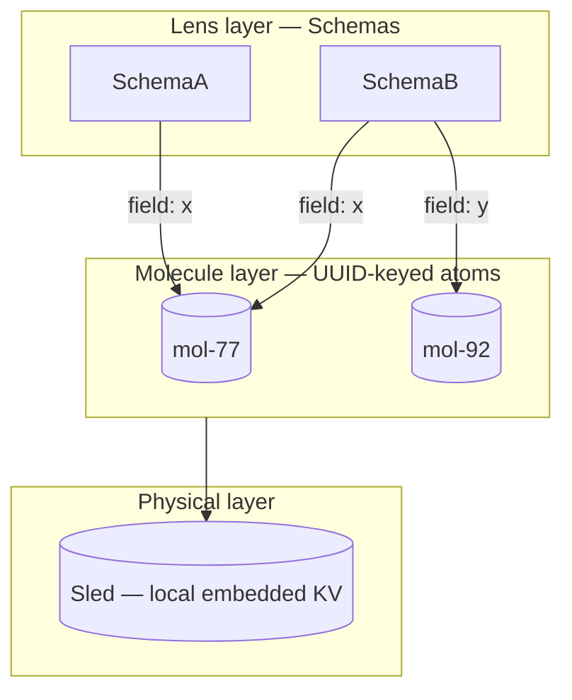
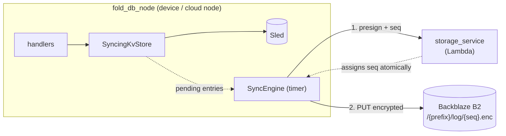
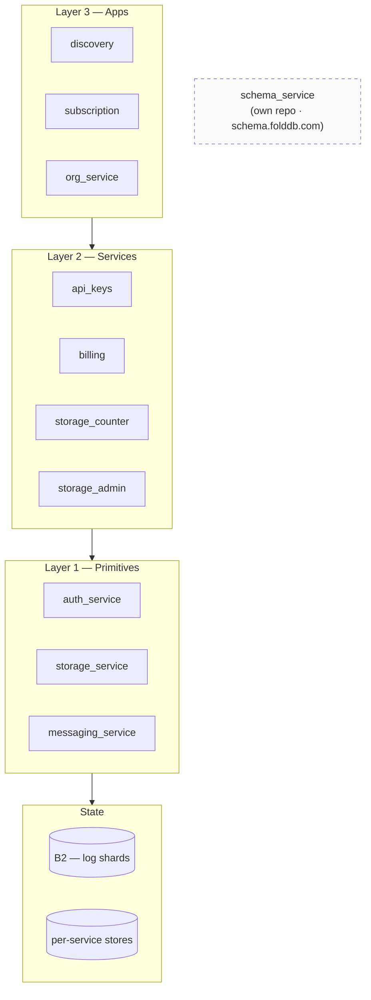
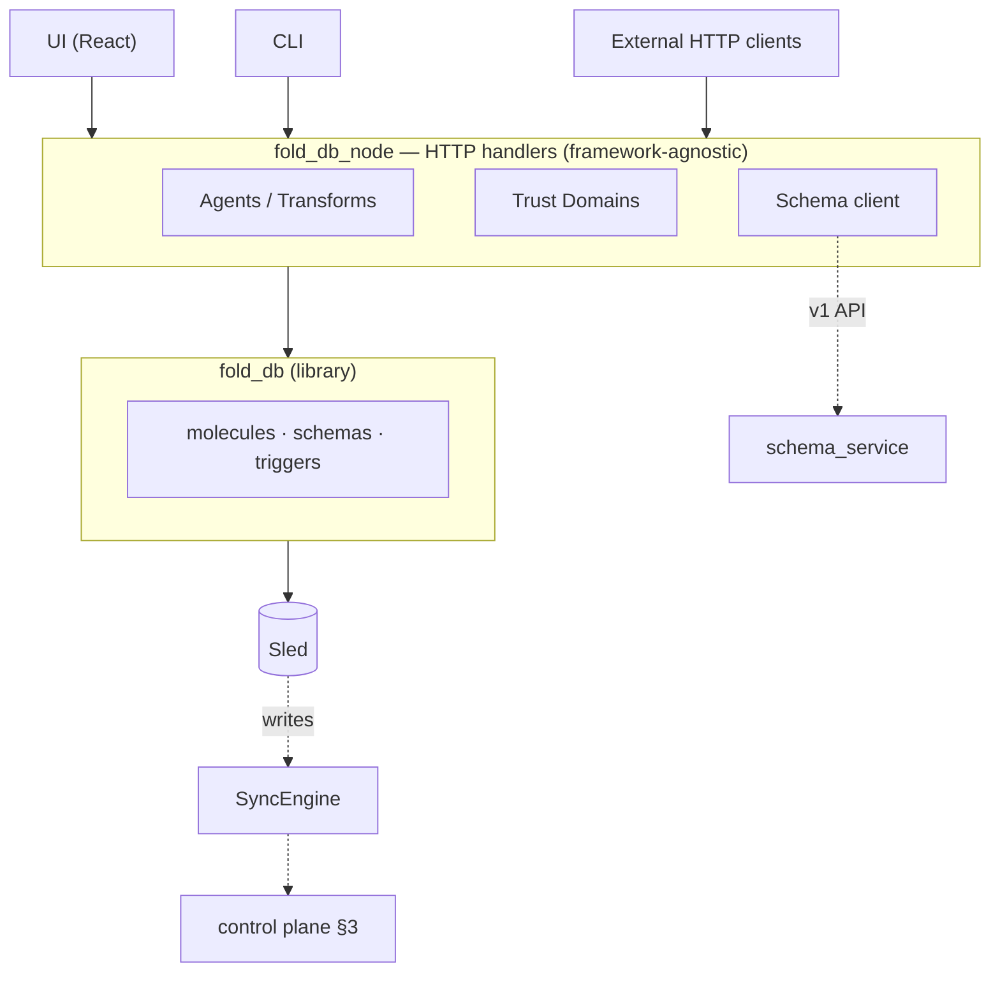

# Exemem + FoldDB: a systems overview

Four orthogonal planes, composed — not a monolith with features bolted on. This page describes what the platform *is* at the systems level, independent of any particular feature it exposes.

## 1. The substrate: molecule-addressed storage

The database is not rows-in-tables. It's a bag of UUID-addressed **molecules** (mutable atoms of data). Schemas are *lenses*, not containers — they bind a field name to a molecule UUID. Two schemas pointing at the same molecule see and write the same bytes.

Consequence: schema evolution is a *lens swap*, not a data migration. Trigger-driven transforms (WASM) recompute derived molecules when upstream ones mutate — views are first-class data, not queries.

## 2. The sync plane: append-only encrypted log per prefix

Sled is always the live DB. Durability, multi-device, and org-sharing all ride on *one* mechanism: an append-only log of encrypted write events, partitioned by prefix.

- `prefix = user_hash` → encrypted with node's E2E key (personal)
- `prefix = org_hash` → encrypted with org's shared key (org)

Download is symmetric: list after cursor → decrypt → replay into Sled. **No** device IDs, member IDs, or special org path — provenance lives on the data (`pub_key` on the mutation), not on the sync path.

## 3. The control plane: Lambdas as primitives, not apps

`exemem-infra` is layered — L1 primitives, L2 services, L3 apps. FoldDB itself is **not** a Lambda; queries run in-process on the node. The cloud's job is coordination, not data access.

`schema_service` lives *beside* this stack — schemas are not per-tenant data, they're a shared registry with similarity-dedup across all FoldDB instances.

## 4. The node: where policy lives

`fold_db_node` is the thing users actually run (Tauri app / headless server). It composes fold_db + HTTP handlers + agents + trust domains + UI.

## The shape, in one sentence

**FoldDB** is a molecule-addressed local-first store whose schemas are lenses and whose views are triggered transforms. **Exemem** is what you get when you point that store's write-log at a shared object store, assign sequence numbers via a primitives Lambda stack, and let any number of nodes replay the same prefix under the same key. Trust domains, orgs, and multi-device are all the same mechanism with a different prefix + key.
