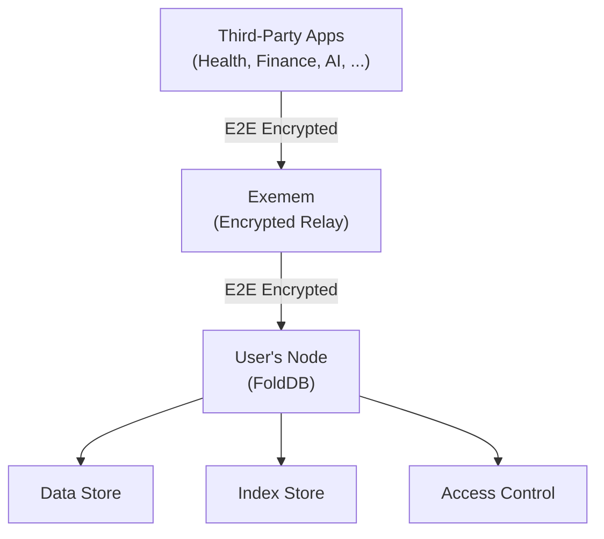
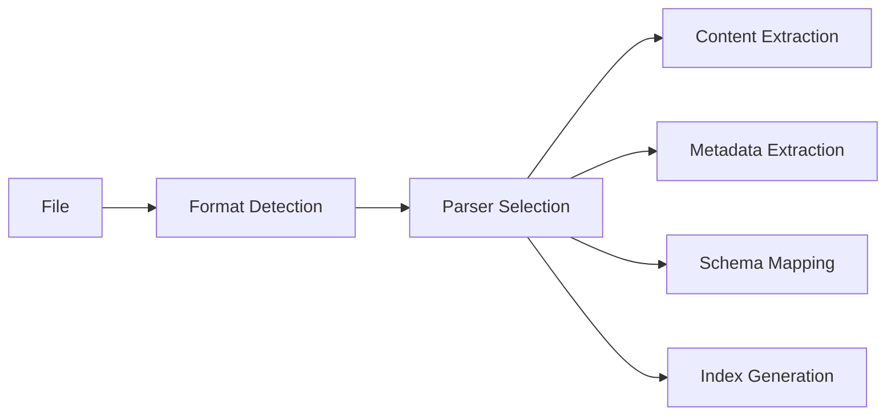
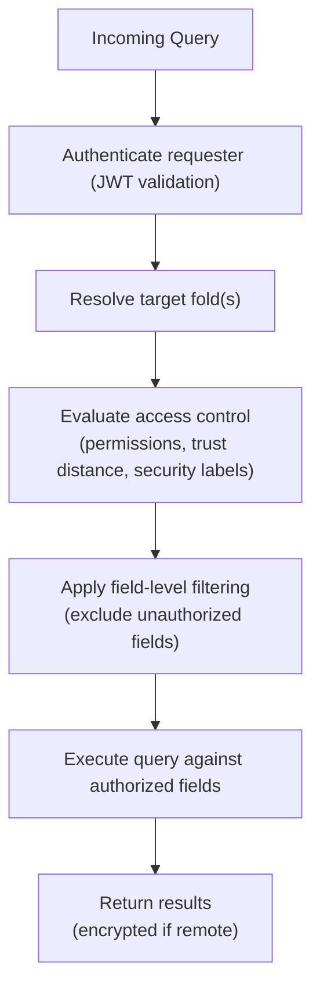
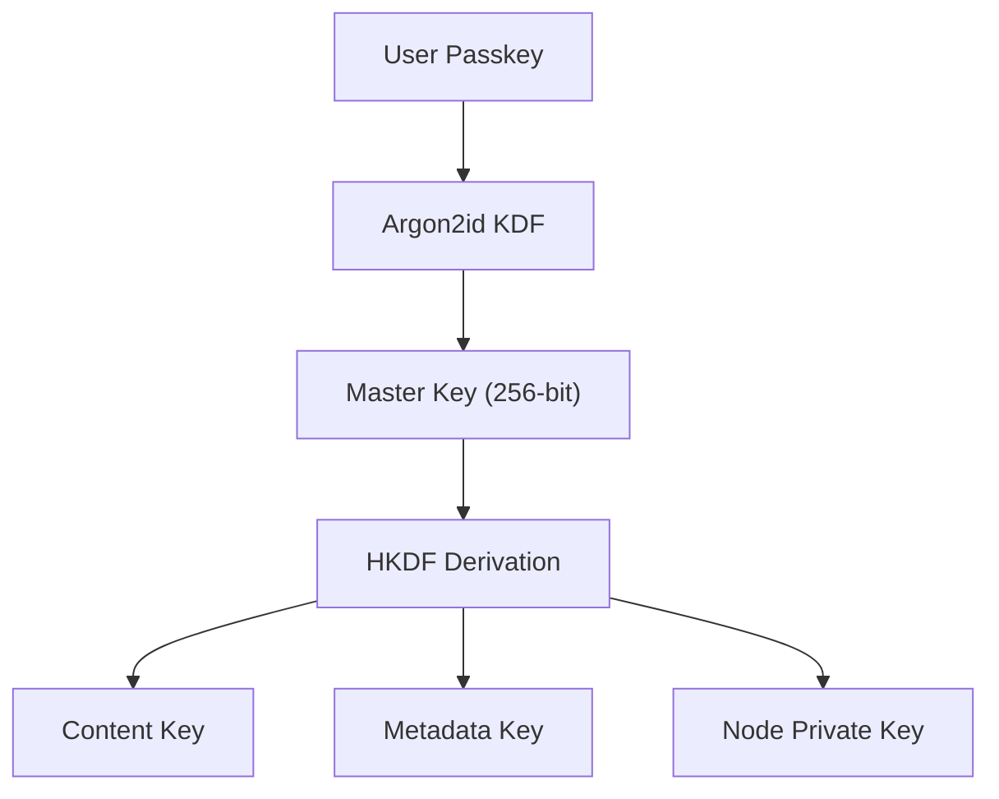

# EdgeVector Architecture Overview

**Edge Vector Foundation, 2026**

---

## Abstract

EdgeVector is a distributed data architecture in which user-controlled nodes (running FoldDB) are the sole authority over stored data. Third-party applications access data through *folds* — schema-enforced, field-level access control interfaces that evaluate permissions, trust distance, security labels, and payment gates at query time. All communication between applications and user nodes passes through Exemem, an encrypted relay that validates JWTs and enforces mechanical limits (access counts, expiration) but never sees plaintext. Data at rest is encrypted with AES-256-GCM using keys derived from a user passkey via Argon2id + HKDF. Node identity is established through Ed25519 keypairs, and multi-device availability is supported via passkey-encrypted config blobs stored on the relay.

This document describes the system architecture, schema system, access control model, encryption and key management, e2e encrypted relay protocol, ingestion pipeline, query engine, and node bootstrap process.

---

## 1. Introduction

### 1.1 The Problem

Modern life produces a vast and growing archive of personal data: documents, source code, emails, notes, health records, financial data, photos, configuration files, and more. These artifacts collectively represent a user's **personal data corpus** — the accumulated digital record of their professional, creative, and personal life.

Applications that want to use this data — whether productivity tools, health trackers, financial planners, or AI assistants — require users to upload it to centralized cloud systems. This introduces several critical problems:

1. **Privacy exposure.** Sensitive data — medical records, financial information, proprietary code, personal communications — must be transmitted to and stored on third-party servers.

2. **No user control.** Once data reaches a platform, users have no meaningful control over how it is used, who sees it, or whether it is truly deleted.

3. **Fragmented access.** Each application maintains its own silo of user data. No existing system provides unified access across a user's entire data corpus with consistent access controls.

4. **Vendor lock-in.** Platform-based data systems bind users to specific services, making data portability difficult or impossible.

The fundamental tension is clear: applications need structured access to data, but users need sovereignty over that data. These goals are treated as mutually exclusive by current architectures.

### 1.2 Our Thesis

EdgeVector proposes that this tension is resolvable. The key insight is:

> Data infrastructure does not need to be centralized. It can run on user-controlled nodes, with applications accessing data through policy-enforcing interfaces — never by possessing it directly.

Three converging trends make this feasible now:

- **Mature cryptographic tooling.** End-to-end encryption, zero-knowledge proofs, and key derivation frameworks are production-ready and widely deployed.
- **Commodity high-capacity storage.** Multi-terabyte NVMe drives are affordable consumer hardware, capable of sustaining the I/O throughput required for large-scale data indexing.
- **Regulatory momentum.** GDPR, CCPA, and emerging data sovereignty legislation are creating both legal frameworks and user expectations around data ownership.

---

## 2. System Architecture

FoldDB is a **personal data database**. It indexes and stores user data, enforces access control policies, and exposes structured interfaces (folds) through which applications can query and interact with data — without ever possessing it directly.

### 2.1 High-Level Architecture



The architecture consists of six core subsystems:

1. **Data Ingestion Engine** — imports, parses, and indexes user data
2. **Schema System** — defines structured interfaces (folds) over data
3. **Access Control Layer** — enforces per-fold permissions, trust distance, and security labels
4. **Query Engine** — processes queries against folds with policy enforcement
5. **Encryption Layer** — protects all data at rest and in transit
6. **Relay Layer (Exemem)** — routes encrypted requests between apps and user nodes

### 2.2 Design Principles

- **User sovereignty.** The user's node is the sole authority over their data. No external system — including Exemem — can read, modify, or access user data.
- **Zero plaintext exposure.** Data in transit between apps and user nodes is end-to-end encrypted. Exemem sees only ciphertext.
- **Policy-enforcing interfaces.** Applications never access raw data. All access goes through folds that enforce field-level permissions, trust distance, and security labels.
- **No fallbacks.** If the user's node is offline, requests fail. There is no degraded mode, no cached plaintext, no pre-issued decryption keys.
- **Format-agnostic.** The system supports a broad range of file types through pluggable parsers.

---

## 3. Data Ingestion Pipeline

### 3.1 Supported Formats

The initial release targets the following file types:

| Category    | Formats                                |
|-------------|----------------------------------------|
| Text        | Markdown, plain text, RTF              |
| Code        | All major languages (via tree-sitter)  |
| Data        | JSON, CSV, YAML, TOML                  |
| Documents   | PDF, DOCX, HTML                        |
| Email       | EML, MBOX                              |
| Notes       | Org-mode, Apple Notes export           |

File types outside this whitelist are ignored. The whitelist is user-configurable and extensible.

### 3.2 Parsing Strategy

Each file type has a dedicated parser that extracts two outputs:

1. **Structured data** — the content of the file, normalized into schema-conformant records.
2. **Metadata** — format-specific attributes extracted during parsing.

For source code files, the parser additionally extracts:

- Function and method names
- Class and type definitions
- Comments and docstrings
- Import/dependency declarations
- File structure (module hierarchy)

Parsing is implemented as a pipeline of composable stages:



### 3.3 Schema Inference

When data is ingested, FoldDB uses schema inference to propose a schema (fold) that fits the incoming data. A schema service detects similarity to existing schemas, preventing duplication across different data sources. Users approve or modify proposed schemas before data is committed.

---

## 4. Schema System (Folds)

### 4.1 What is a Fold?

A **fold** is a named, versioned interface definition that specifies:

- Which fields exist and their types
- Who can read or write each field (permissions)
- What trust distance is required for access
- What security labels apply
- Optional transform functions (computed views over source data)

Folds are the core abstraction that separates data ownership from data access. An application does not access "user's health data" — it accesses a specific fold like `health.heart_rate` with specific permissions granted by the user.

### 4.2 Access Control

Each fold field carries its own access control policy:

| Control             | Description                                           |
|---------------------|-------------------------------------------------------|
| **Permissions**     | Read, write, or no access — per field, per requester  |
| **Trust Distance**  | How many hops from the data owner the requester is    |
| **Security Labels** | Classification levels (e.g., public, private, sensitive) |
| **Payment Gates**   | Optional micropayment required for access             |

Access control is enforced on the user's node at query time. No external system participates in the decision.

### 4.3 Transform Folds

Transform folds are computed views over source folds. They define a derivation function (optionally as WASM) that transforms source data into a new shape. Transform folds:

- Store no data — they compute on read
- Can restrict which fields of the source are visible
- Support inverse transforms for write-back
- Enable users to expose derived views without exposing raw data

---

## 5. Delta Scanner

### 5.1 Purpose

The delta scanner is a background process that keeps the index synchronized with the user's data sources. Rather than re-indexing everything on each pass, it detects only the data that has changed and processes it incrementally.

### 5.2 Algorithm

```
1. Walk the target data sources
2. For each record/file:
   a. Compute content hash (BLAKE3)
   b. Compare against stored hash
   c. If hash differs or record is new:
      - Re-parse content
      - Update metadata
      - Update indexes
   d. If record is deleted:
      - Remove from all indexes
3. Record scan timestamp
4. Sleep until next scan interval
```

### 5.3 Performance Characteristics

- **Hashing:** BLAKE3 processes data at memory bandwidth speeds (>10 GB/s on modern hardware), making hash comparison negligible in cost relative to I/O.
- **Incremental updates:** Only changed records trigger the full parse-index pipeline. A typical scan of 500,000 files with <1% change rate completes in seconds.
- **Filesystem events:** On supported platforms, the scanner optionally subscribes to filesystem notification APIs (FSEvents on macOS, inotify on Linux) to detect changes without polling.

---

## 6. Query Engine

### 6.1 Query Model

All queries are scoped to folds. A query specifies:

- The target fold(s)
- Field filters and conditions
- Sort order
- The requester's identity (for access control evaluation)

The query engine evaluates access control policies before returning any data. Fields the requester cannot access are excluded from results — the requester cannot distinguish "field has no data" from "field exists but you lack permission."

### 6.2 Query API

FoldDB exposes a local HTTP API for direct access and accepts relayed requests from Exemem for remote access.

**REST API:**

```
POST /v1/query
{
  "schema": "health.heart_rate",
  "fields": ["timestamp", "bpm"],
  "filters": {
    "modified_after": "2025-01-01"
  },
  "sort_order": "desc"
}
```

```
GET /v1/schema/{schema_name}
GET /v1/schemas
GET /v1/stats
```

### 6.3 Query Pipeline



---

## 7. Security Model

### 7.1 Threat Model

FoldDB assumes the following threat model:

- **Trusted:** The user's device and its operating system.
- **Untrusted:** All networks, cloud services (including Exemem), and third-party applications.
- **Goal:** Even if the FoldDB data directory is exfiltrated (e.g., stolen laptop), the content must remain unreadable without the user's passkey. Even if Exemem is compromised, no user data is exposed — Exemem only holds ciphertext.

### 7.2 Encryption Architecture

| Layer         | Encryption          | Rationale                                  |
|---------------|---------------------|--------------------------------------------|
| **At rest**   | AES-256-GCM         | All stored data encrypted on disk          |
| **In transit**| E2E (app ↔ node)    | Exemem sees only ciphertext                |
| **Keys**      | Encrypted at rest   | Master key derived from user passkey       |

### 7.3 Key Management



- The **master key** is derived from the user's passkey using Argon2id with high memory and iteration parameters.
- **Per-purpose keys** are derived from the master key using HKDF.
- The master key is never stored in plaintext. It is held in memory only while the node is running and the user has authenticated.
- A **public/private keypair** (Ed25519) is generated at first launch for node identity and e2e encryption with apps.

### 7.4 Node Bootstrap

When a user sets up a new device:

1. User authenticates with passkey
2. Exemem returns the user's encrypted node config blob (opaque ciphertext)
3. Device decrypts blob using passkey-derived key
4. Node is operational — private key, schemas, and config restored

Exemem stores the encrypted blob but cannot decrypt it. The passkey never leaves the user's device.

### 7.5 E2E Encrypted Relay (Exemem)

Exemem's role is strictly limited:

- **Validates JWTs** — ensures requests come from authorized apps
- **Relays ciphertext** — forwards encrypted requests to user's node, returns encrypted responses
- **Enforces mechanical limits** — access counts, time-based expiration
- **Stores encrypted blobs** — node config, encrypted data backups

Exemem never decrypts, never sees plaintext, never makes access control decisions. It is a dumb encrypted relay.

---

## 8. Third-Party Application Access

### 8.1 Authorization Flow

Third-party apps access user data through the following flow:

```
1. App requests access to specific folds (e.g., health.heart_rate:read)
2. User reviews and approves on their device (passkey authentication)
3. User's node issues a scoped JWT to the app
4. App sends JWT + encrypted request to Exemem
5. Exemem validates JWT, relays encrypted request to user's node
6. User's node decrypts request, evaluates access control, encrypts response
7. Exemem relays encrypted response to app
8. App decrypts response locally
```

### 8.2 Revocation

Users can revoke any app's access instantly from their node. Revocation is effective immediately — the next request from that app is rejected. There is no grace period, no cached access, no pre-issued keys to expire.

### 8.3 Multi-Node

Users can run multiple nodes (e.g., laptop, phone, home server). Any device with the user's passkey can act as a node. More devices means higher availability. All nodes share the same identity and access control policies via the encrypted config blob on Exemem.

---

## 9. Performance

### 9.1 Targets

| Metric                    | Target            |
|---------------------------|-------------------|
| Installation time         | < 2 minutes       |
| Initial indexing speed    | > 200,000 files/hr|
| Incremental scan (500K files) | < 10 seconds  |
| Query latency             | < 500ms           |
| Memory usage (idle)       | < 200 MB          |
| Memory usage (indexing)   | < 1 GB            |
| Disk overhead             | ~20% of source    |

### 9.2 Optimizations

- **Parallel ingestion.** File parsing and index generation are parallelized across available CPU cores.
- **Memory-mapped I/O.** Index and metadata stores use memory-mapped files, allowing the OS to manage caching efficiently.
- **Lazy indexing.** Indexes are generated on-demand for newly added data and cached persistently. Unchanged data is never re-indexed.
- **Tiered storage.** Hot metadata (frequently queried) remains in memory; cold data is accessed via memory-mapped disk.

---

## 10. Applications

### 10.1 Near-Term (v1)

- **Personal data search.** Query across all your data — documents, code, notes — from a single interface.
- **Third-party app access.** Grant apps scoped, revocable access to specific data through folds.
- **Data portability.** Export any fold as structured data. No lock-in.

### 10.2 Medium-Term (v2)

- **Micropayments.** Monetize access to your data through payment-gated folds.
- **Cloud sync and resilience.** Optional encrypted backup to user-controlled cloud storage.
- **Mobile access.** Run a node on your phone for always-available data access.

### 10.3 Long-Term Vision

EdgeVector envisions a future where individuals operate **sovereign data nodes**. Each node:

- Stores and indexes its owner's data locally
- Enforces access control policies defined by the owner
- Optionally connects to other nodes in a **distributed data network**

In this architecture, applications access data through policy-enforcing folds, not by possessing it. Collaboration happens through structured queries between nodes, not by centralizing data. Privacy is preserved because each node decides what to share, with whom, and under what conditions.

This is the vision of **personal data infrastructure** — the data sovereignty equivalent of personal computing.

---

## 11. Related Work

| System              | Approach                          | Key Limitation                         |
|---------------------|-----------------------------------|----------------------------------------|
| Google Drive / iCloud| Cloud storage with app integrations| Data on platform servers; platform controls access |
| Solid (Berners-Lee) | Decentralized data pods           | Limited ecosystem adoption; no native encryption |
| Blockchain storage  | Immutable distributed ledger      | Poor performance; data is public by default |
| Apple Health        | On-device health data store       | Single domain; Apple-controlled API    |
| Self-hosted (Nextcloud)| User-hosted cloud replacement  | Requires sysadmin skills; no access control model |

EdgeVector differentiates by combining **schema-enforced access control**, **end-to-end encryption**, **multi-domain data support**, **automatic ingestion**, and **a relay architecture that never exposes plaintext** — in a system designed for non-technical users.

---

## 12. Organizational Structure

EdgeVector operates as a **non-profit foundation** (Edge Vector Foundation) with a for-profit subsidiary.

- The **foundation** stewards the open-source FoldDB core, maintains the protocol specifications, and governs the ecosystem.
- The **subsidiary** (Exemem) builds commercial products on top of the open-source platform: the encrypted relay service, managed cloud sync, mobile applications, and premium support.

This structure ensures that the core technology remains open and community-governed while enabling sustainable commercial development.

---

## 13. Conclusion

The current paradigm of centralized data infrastructure forces a false trade-off between utility and privacy. EdgeVector rejects this trade-off.

By keeping data on user-controlled nodes — encrypted at rest, accessible only through policy-enforcing folds, and shared only with explicit revocable permission — FoldDB demonstrates that applications can access a user's data without that data ever leaving the user's control.

The technical foundations are sound: cryptographic tooling is mature, storage is cheap, and the access control model is formally defined. What has been missing is the infrastructure that ties these components together into a coherent, privacy-preserving data platform.

FoldDB is that infrastructure. EdgeVector is the architecture. The shift from platform-owned data to user-owned data starts here.

---

*Edge Vector Foundation — edgevector.org*
